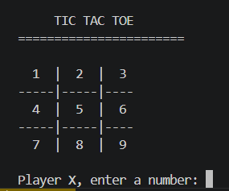

# Tic Tac Toe Game in C++

A console-based Tic Tac Toe game developed using C++ that demonstrates core programming concepts such as arrays, loops, functions, and conditional statements.

## Features

- Two-player gameplay
- Dynamic game board display
- Win detection system
- Draw detection
- Invalid move checking
- Replay functionality

## Technologies Used

- C++
- Arrays
- Nested Loops
- Functions
- Conditional Statements

## How to Run

### Compile

```bash
g++ main.cpp -o game
```

### Run

```bash
.\game
```

## Learning Outcomes

This project helped in understanding:

- 2D arrays
- Game logic implementation
- Function creation
- Input validation
- Loop control
- Problem-solving in C++

## Sample Output

```plaintext
     TIC TAC TOE
=====================

     X  |  O  |  X
    ----|-----|---
     4  |  O  |  6
    ----|-----|---
     X  |  8  |  9
```

## Future Improvements

- Single-player mode
- AI opponent
- Better UI design
- Score tracking system

## Output Screenshot

